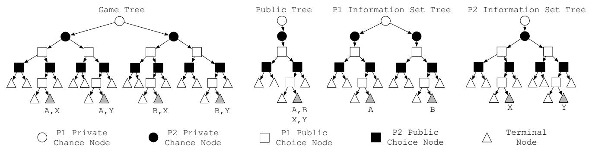
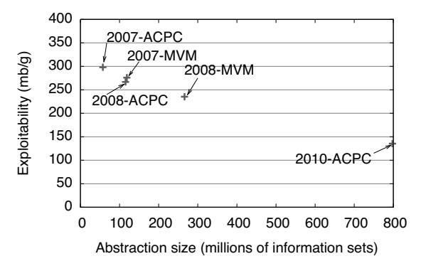
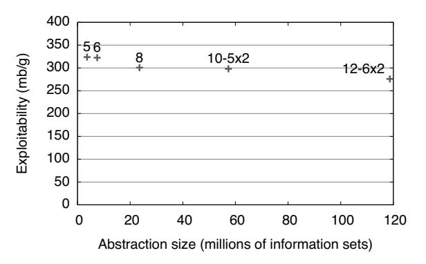
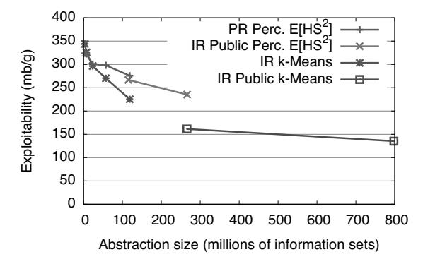
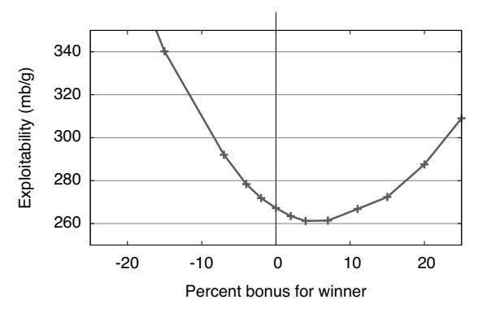
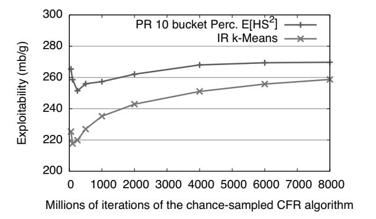

# **Accelerating Best Response Calculation in Large Extensive Games**

#### **Michael Johanson**

johanson@ualberta.ca
Department of Computing Science
University of Alberta
Edmonton, Alberta, Canada

#### Michael Bowling

bowling@ualberta.ca
Department of Computing Science
University of Alberta
Edmonton, Alberta, Canada

#### Abstract

One fundamental evaluation criteria of an AI technique is its performance in the worst-case. For static strategies in extensive games, this can be computed using a best response computation. Conventionally, this requires a full game tree traversal. For very large games, such as poker, that traversal is infeasible to perform on modern hardware. In this paper, we detail a general technique for best response computations that can often avoid a full game tree traversal. Additionally, our method is specifically well-suited for parallel environments. We apply this approach to computing the worst-case performance of a number of strategies in heads-up limit Texas hold'em, which, prior to this work, was not possible. We explore these results thoroughly as they provide insight into the effects of abstraction on worst-case performance in large imperfect information games. This is a topic that has received much attention, but could not previously be examined outside of toy domains.

### 1 Introduction

Extensive games are a powerful framework for modeling sequential stochastic multi-agent interactions. They encompass both perfect and imperfect information games allowing work on extensive games to impact a diverse array of applications.

To evaluate an extensive game strategy, there are typically two options. The first option is to acquire a number of strategies and use an appropriately structured tournament. This is, by far, the most common option in the AI community, and is used by the Annual Computer Poker Competition, the Trading Agent Competition, RoboCup, the General Game Playing competition, SAT and Planning competitions, and so on.

## **Kevin Waugh**

waugh@cs.cmu.edu
Department of Computer Science
Carnegie Mellon University
Pittsburgh, PA, USA

#### **Martin Zinkevich**

maz@yahoo-inc.com Yahoo! Research 2821 Mission College Blvd. Santa Clara, CA, USA

While the tournament structure will ultimately declare a winner, it is not always clear how to interpret the results. That is, which strategy is indeed the best when the results are noisy, have intransitivities, or there are multiple evaluation criteria?

The second option is to compute or bound the worst-case performance of a strategy. Good worst-case performance suggests a strategy is robust to the choices of the other players. In zero-sum games, the worst-case performance takes on additional importance, as it is intimately tied to the Nash equilibrium concept. A strategy's worst-case performance can be computed using a best response calculation, a fundamental computation in game theory. Conventionally, the best response computation begins by examining each state once to compute the value of every outcome, followed by a pass over the strategy space to determine the optimal counter-strategy. For many games, this is infeasible with modern hardware, despite requiring only a single traversal of the game. For example, two-player limit Texas hold'em has  $9.17*10^{17}$  game states, which would require ten years to examine even if one could process three billion states per second.

Since best response computation has been thought to be intractable for two-player limit Texas hold'em, evaluation has focused on competitions instead. The Annual Computer Poker Competition holds an instant runoff tournament for variants of Texas hold'em poker. Historically, top entrants to this tournament have aimed to approximate Nash equilibrium strategies using increasingly finer abstractions and efficient equilibrium-finding techniques. More accurate solutions to ever finer abstractions were thought to improve worst-case performance and result in stronger tournament performance. While tournament results suggested this was happening, recent work shows that finer abstractions give no guarantee of improving worst-case performance [Waugh et al., 2009a]. This finding was demonstrated on a toy domain where bestresponse computations were feasible. To date, no one has measured the worst-case performance of a single non-trivial strategy in any of the competition events.

In this paper, we describe general techniques for accelerating best response calculations. The method uses the structure of information and utilities to avoid a full game tree traversal, while also being well-suited to parallel computation. As a result we are able for the first time to compute the worst-case performance of non-trivial strategies in two-player limit Texas hold'em. After introducing these innovations, we use our technique to empirically answer a number of open questions related to abstraction and equilibrium approximation. We show that in practice finer poker abstractions do produce better equilibrium approximations, but better worst-case performance does not always result in better performance in a tournament. These conclusions are drawn from evaluating the worst-case performance of over three dozen strategies involving ten total CPU years of computation.

#### 2 Background

We begin with a brief description of an extensive game; a formal definition can be found in [Osborne and Rubinstein, 1994, Ch. 11]. An extensive game is a natural model of interaction between players in an environment. A **history**  $h \in H$ is the sequence of actions taken by all of the players, including the **chance player** whose actions represent random events such as card deals or dice rolls. A player function P(h) determines which player is next to act. Taking an action a in a history h produces a new history ha. A subset of all histories are **terminal histories**. At a terminal history z, the game is over and the players are assigned utilities according to a utility function, where  $u_i(z)$  is the utility for player i. If there are two players and the utilities sum to 0 (so  $u_1(z) = -u_2(z)$ for all z), then we say the game is **zero-sum**. An extensive game can be intuitively thought of as a game tree, where each history is a game state and actions by the players cause transitions to new histories.

In games of **imperfect information**, some of the actions by the players, or chance, may not be fully revealed. One example is the game of poker, in which chance deals private cards face-down to each player, and these cards determine the utilities at the end of the game. To represent such cases, we use **information sets** to group indistinguishable histories. If player 1 cannot see player 2's cards, for example, then all of the histories that are differentiated only by player 2's cards are in the same information set for player 1. When a player is to choose an action, their choice only depends on the information set, not the underlying history.

A **strategy** for a player  $i, \sigma_i \in \Sigma_i$ , is a function that assigns a probability distribution over the actions to each information set I. When player i must select an action at I, they sample an action from the probability distribution  $\sigma_i(I)$ . Note that in games such as poker where the agents alternate positions after each game, an agent will have one strategy to use in each position. A **player** has a specified position in the game, while an **agent** has a strategy for every position in the game.

A **strategy profile**,  $\sigma \in \Sigma$ , consists of a strategy for each player. We use  $\sigma_{-i}$  to refer to all of the strategies in  $\sigma$  except for  $\sigma_i$ . As a strategy profile defines the probability distribution over actions for all of the non-chance players, it is

sufficient to determine the expected utility for each player, denoted  $u_i(\sigma)$ . Similarly, we define  $u_i(\sigma_1, \sigma_2) = u_i(\sigma_1 \cup \sigma_2)$ .

A **best response** is the optimal strategy for player i to use against the opponent profile  $\sigma_{-i}$ . It is defined as

$$b_i(\sigma_{-i}) = \operatorname*{argmax}_{\sigma_i' \in \Sigma_i} u_i(\sigma_{-i}, \sigma_i'). \tag{1}$$

The value of the best response,  $u_i(b_i(\sigma_{-i}), \sigma_{-i})$ , is how much utility the best response will receive on expectation. In two player games, this value is also useful as a worst-case evaluation of the strategy  $\sigma_i$ , as  $u_i(\sigma_i, b_{-i}(\sigma_i))$  is a lower bound on player i's utility on expectation.

Two-player zero-sum games have a **game value**,  $v_i$ , that is the lower bound on the utility of an optimal player in position i. In this case, we use the term **exploitability** to refer to the difference

$$\varepsilon_i(\sigma_i) = v_i - u_i(\sigma_i, b_{-i}(\sigma_i)). \tag{2}$$

The exploitability of a strategy is thus how much additional utility is lost to a worst-case adversary by playing  $\sigma_i$ , instead of a strategy that achieves the game's value. A strategy is **unexploitable**, or optimal, if this difference is zero.

In large two player zero-sum games such as poker, the value of the game is unknown and is intractable to compute; however, if the players alternate positions, then the value of a pair of games is zero. If an agent plays according to profile  $\sigma$  then its exploitability is

$$\varepsilon(\sigma) = \frac{u_2(\sigma_1, b_2(\sigma_1)) + u_1(b_1(\sigma_2), \sigma_2)}{2}.$$
 (3)

A Nash equilibrium is a strategy profile  $\sigma$  that has the property that no player can benefit by unilaterally deviating.

**Definition 1**  $\sigma$  is a Nash Equilibrium if

$$u_i(\sigma) \ge u_i(\sigma_{-i} \cup \sigma_i'), \forall i \in N, \forall \sigma_i' \in \Sigma_i.$$
 (4)

In two player zero-sum games, a Nash equilibrium is unexploitable: against any opponent the strategy will win no less than the value of the game. However, in large games it may be intractable to compute such a strategy. In such cases, an aligned goal is to attempt to approximate an equilibrium with a low exploitability strategy, thus bounding its worst-case performance. Various abstraction and equilibrium computation methods have been applied to making what were hoped to be good equilibrium approximations. While many of these have been applied to building strategies for two-player limit Texas hold'em, it has been previously infeasible to evaluate their worst-case performance in such a large domain.

### **3** Conventional Best Response

Conventionally, a best response can be easily computed through a recursive tree walk that visits each game state once. To illustrate this algorithm, we will refer to Figure 1, which presents four views of the simple game of 1-Card Poker. Consider the diagram labelled "Game Tree", which represents the exact state of the game. The game begins at the root, where the white circle nodes represent chance privately giving one card to Player 1. The children, black circles, represent chance privately giving one card to Player 2. Descending through the

Figure 1: Four trees for the game of 1-Card Poker.

tree, the white and black squares represent players 1 and 2 respectively making public betting actions, before arriving at the terminal nodes, represented by triangles.

Since there is private information in this game, each player has a different view of the game, which is represented by the "P1 Information Set Tree" and "P2 Information Set Tree" diagrams. In these diagrams, the private information provided to the opponent by chance is unknown, and so the black and white circles for the opponent have only one child. Each node in these trees represents a set of game states that the player cannot distinguish. For example, if Player 1 reaches the terminal node labelled 'A' in their information set tree, they cannot determine whether they are in the game tree node labelled 'A,X' or 'A,Y', as these nodes are distinguished only by the opponent's private information, while all of the public actions leading to these nodes are identical.

Consider computing a best response from Player 2's perspective. We will do a recursive tree walk over their information set tree. At a terminal node, such as the one labelled 'X', we must consider all of the game states that the game could actually be in: 'A,X' or 'B,X'. Specifically, we need to know the probability that the opponent would reach the nodes 'A' and 'B' in their tree, according to their strategy being used at their earlier decision points and chance's strategy; we will call this vector of probabilities the **reach probabilities**. Given these probabilities, we can compute the unnormalized value for us reaching 'X' to be the sum over the indistinguishable game states of each game state's utility times that game state's reach probability. We then return this value during our tree walk. Recursing back through our choice nodes, the black squares, we will pick the highest valued action to create our best response strategy, and return the value of this action. At opponent choice nodes and chance nodes, the white squares and circles, we simply return the sum of the child values. When we return to the root, the returned value is the value of the best response to the opponent's strategy. Performing this computation from each position gives us both best response values, and thus by Equation 3, the exploitability of the strategy.

Note that there is an obvious enhancement to this algorithm. Instead of recomputing the opponent's vector of reach probabilities at each terminal node, during our recursive tree walk we can pass forward a vector containing the product of probabilities of the earlier actions in the tree. This allows us

to query the opponent's strategy once for each of its earlier actions and reuse the strategy's action probability at all of its descendent terminal nodes. In large domains, the opponent's strategy might be many gigabytes and be stored on disk or otherwise have a nontrivial cost to do such queries, and it is important to take advantage of opportunities to cache and reuse these computed values. Thus, our recursive tree walk will pass forward a vector of reach probabilities for the states in an information set, and return the value for reaching an information set.

### 4 Accelerated Best Response

The conventional best-response computation visits each game state exactly once, and is thus seemingly efficient. However, in large games such as Texas hold'em poker, with 1018 states, having to visit each state once makes the computation intractable. In this section, we will show four ways that this conventional algorithm can be accelerated: (1) traversing a different type of tree, which allows more opportunities for caching and reusing information; (2) using properties of the game's utilities to efficiently evaluate terminal nodes of the public tree; (3) use game-specific isomorphisms to further reduce the size of the expanded tree; (4) solving independent sections of this new tree in parallel.

**Public State Tree.** We begin by presenting the heart of the accelerated best response algorithm.

**Definition 2 (Public State)** We call a partition of the histories, P, a public partition and  $P \in P$  a public state if

- no two histories in the same information set are in different public states (i.e., if information is public, all players know it)
- two histories in different public states have no descendants in the same public state (i.e., it forms a tree), and
- no public state contains both terminal and non-terminal histories (we call a public state with terminal histories a terminal public state).

Informally, a public state is defined by all of the information that both players know, or equivalently, what the game looks like to an observer that knows no private information. Like the histories, it forms a tree that we can traverse. Though it is not provided by an extensive game's description, it is trivial to come up with a valid public information partition, and many games have a natural notion of public information. Following our earlier example of 1-Card Poker, Figure 1 shows an example of the public tree, beside the much larger game tree.

In our earlier example illustrating the conventional algorithm, we used Figure 1 to describe that when we are at terminal node X, we do not know if the opponent is at node A or B, and so we must compute the reach probabilities for the opponent and chance reaching each of these states. However, there is an important opportunity to reuse these probabilities; just as we cannot distinguish between their private states, the opponent cannot distinguish if we are at node X or node Y, and so the reach probabilities are identical when we are in either state.

The public tree provides a structured way to reuse these computed probabilities. Every node in the public tree represents a set of game states that cannot be distinguished by an outside observer, and also partitions the information sets for the players. Instead of finding a best response by walking over the information set tree, as in the conventional algorithm, we will instead recursively walk the much smaller public tree. When we reach a terminal node such as the one labelled "A,B,X,Y" in Figure 1, we know that player 1 could be in nodes A or B as viewed by player 2, and that player 2 could be in nodes X or Y as viewed by player 1. From player 2's perspective, we can calculate the vector of player 1's reach probabilities for A and B once, and reuse these probabilities when computing the value for both X and Y. Instead of passing forward a vector of reach probabilities and returning a single value for the one information set being considered, as we do in the conventional algorithm, we will instead pass forward a vector of reach probabilities and return a vector of values, one for each of our information sets in the public state. At our decision nodes, we will pick the best action for each information set by recursing to get a vector of values for each action, and return a vector where each entry is the max of that entry across the action value vectors. At opponent decision nodes and chance nodes, we will recurse to find the child value vectors, and return the vector sum of these vectors. At terminal nodes, the value for each information set can be found by evaluating each one at a time, as in the conventional algorithm, although later we will present a faster technique that produces the same values.

Thus, the public tree walk performs exactly the same computations as the conventional algorithm, and only the order of these computations has changed so that we can more efficiently reuse the queries to the opponent's strategy. In a game like Texas hold'em where each player has up to 1326 information sets in each public state, this allows us to avoid 1325 unnecessary strategy queries. As previously mentioned, if querying the opponent's strategy is nontrivial and forms a bottleneck in the computation, the speed advantage is substantial, as it may do as little as  $\frac{1}{1326}$  times as much work. In practice, we estimate that this change may have resulted in a 110 times speedup.

Efficient Terminal Node Evaluation. The second way to accelerate the calculation involves improving the terminal public state utility calculation by exploiting domain specific properties of the game. When reaching terminal public states during the traversal, we have a vector of probabilities for the opponent reaching that public state with each of their information sets, and need to compute the value of each of our information sets. A naive approach is to consider each pair of information sets in the public state. This is an  $O(n^2)$  computation, assuming n information sets per player. However, games of interest typically have structure in their payoffs. Very often this structure can allow an O(n) computation at the terminal nodes, particularly when the distribution over the players' information sets are (nearly) independent.

Example 1. Suppose the players' information sets are factorable and only some of the factors affect the utilities at any particular public state. For example, in a negotiation game, a player may have information that affects the utility of many different negotiated outcomes, but only the information associated with the actual negotiated outcome affects that public state's utility. If the number of relevant information sets is only  $O(\sqrt{n})$  and the information sets are independently distributed, then the  $O(n^2)$  computation can be done in only O(n) time.

Example 2. Suppose the players' information sets make independent and additive contributions to the best-response player's utility. For example, consider a game where goods are being distributed and the players have independent estimates for a good's true value. If the player's utility is the true value of the acquired goods, then each player's estimate is making an independent contribution. In such a situation, the expected opponent's contribution can be first computed independently of the best-response player's information set, allowing the whole utility calculation to be completed in O(n) time.

Example 3. Suppose we can sort each players' information sets by "rank", and the utility only depends upon the relative ordering of the players' ranks. This is exactly the situation that occurs in poker. For the moment, let us assume the distribution of the players' ranks are independent. In this case, evaluating each of our information sets requires only O(n) work. We know that our weakest information set will be weaker than some of the opponent's hands, equal to some, and better than some. We keep indices into the opponent's ordered list of information sets to mark where these changes occur. To evaluate our information set, we only need to know the total probability of the opponent's information sets in these three sections. After we evaluate one of our information sets and move to a stronger one, we just adjust these two indices up one step in rank.

This approach can be used in cases where the players' hidden information is independent. However, even if the information sets are dependent, as in poker where one player holding a card excludes other players from holding it, we may still be able to do an O(n) evaluation. We will use the game of Texas hold'em as an example. In this game, a 52-card deck is used, five cards are revealed, and each player holds two cards. We proceed as before, and evaluate each of our (47 choose 2) possible hands, considering all (47 choose 2)

hands for the opponent. However, some of the opponent's hands are not possible, as their cards overlap with ours. Using the inclusion-exclusion principle, when computing the total probability of hands better and worse than ours, we subtract the total probability of opponent hands that include either of our cards. The opponent hand that uses both of our cards has then been incorrectly subtracted twice, so we correct by adding its probability back again. This O(n) procedure results in exactly the same value as the straightforward  $O(n^2)$ evaluation. In games such as poker, the ordering of the information sets may not be known until the final action by the chance player is revealed. In such cases, the information sets must be sorted after this occurs, resulting in an  $O(n \log n)$ sorting procedure followed by the O(n) terminal node evaluation. However, the  $O(n \log n)$  sorting cost can be paid once and amortized over all of the terminal node evaluations following the final chance event, reducing its cost in practice. In Texas hold'em, this  $O(n \log n)$  evaluation runs 7.7 times faster than the straightforward  $O(n^2)$  evaluation.

Game-Specific Isomorphisms. The third way to accelerate the calculation depends on leveraging known properties of a strategy. In some games, there may be actions or events that are strategically equivalent. This is true in many card games, where the rank of a card, but not its suit, indicates strength. For example, a  $2\heartsuit$  may be equivalent to a  $2\spadesuit$ , at least until additional cards are revealed; if the chance player later reveals a  $3\spadesuit$ ,  $2\spadesuit$  may then be stronger than a  $2\heartsuit$ . We call such sets of equivalent chance actions isomorphic, and choose one arbitrarily to be **canonical**. If the domain has this property and if the strategy being evaluated is the same for every member of each set of isomorphic histories, then the size of the public state tree can be greatly reduced by only considering canonical actions. On returning through a chance node during the tree walk, the utility of a canonical action must be weighted by the number of isomorphic states it represents. In Texas hold'em, this reduction results in a public state tree 21.5 times smaller than the full game.

Parallel Computation. The fourth and final way in which we accelerate the calculation is to choose subtrees of the public tree that can be solved independently. We rely on the fact that the graph of public states forms a tree, as required by Definition 2, and computing a value vector at a public state requires only the vector of probabilities for the opponent to reach this public state and computations on the subtree of public states descendent from it. Given this, any two public states where one is not descendent from the other will share no descendents and thus have no computations in common, and so can be solved in parallel. For example, when reaching a public chance event during a public tree walk, all of the children could be solved in parallel and the value vector returned as normal once each subtree computation has finished.

In Texas hold'em poker, one natural choice of a set of independent subgames to solve in parallel is at the start of the second round, called the "flop". There are 7 nonterminal action sequences in the first round and 1755 canonical public chance events at the start of the flop, resulting in 12,285 independent subgames for each position, and 24,570 subgames total. Using the accelerated best response technique described above,

each subgame requires approximately 4.5 minutes on average to solve, resulting in a 76 cpu-day sequential computation. Since these subgames are independent, a linear speedup can be achieved by using 72 processors to solve the set of subgames in just over a day. When all of the subgames are complete, walking the small tree from the root to the start of the subgames requires less than a minute to complete.

The four methods described above provide orthogonal speed enhancements over the conventional best response algorithm. By combining them, we can now compute the value of a best response in just over a day, in a domain where the computation was previously considered intractable.

### 5 Application to Texas Hold'em Poker

Our new ability to calculate the exploitability of strategies in large extensive games allows us to answer open questions about abstraction and approximate equilibria which have been raised by the computer poker community. The Annual Computer Poker Competition, which was started in 2006, has popularized poker as a challenging testbed for artificial intelligence research. Annually, over two dozen poker-playing programs are submitted to the competition. Although many approaches are used, the most popular technique is to approximate an unexploitable Nash equilibrium strategy. However, the smallest and most popular variant of poker in the competition, heads-up Limit Texas hold'em, has  $9.17 * 10^{17}$ game states, rendering the computation of an exact solution intractable. Instead, a compromise is made that is common to many large domains in artificial intelligence: a smaller abstract game is constructed and solved, and the resulting abstract strategy is used in the real game.

With this approach, the competitors have made substantial progress in discovering more efficient game solving techniques, such as Counterfactual Regret Minimization [Zinkevich et al., 2008] and the Excessive Gap Technique [Hoda et al., 2010]. More efficient algorithms and more powerful hardware has allowed for larger, finer-grained abstractions to be solved. These new abstractions have involved imperfect recall and a focus on public information [Waugh et al., 2009b], and k-means-clustering-based approaches that better model the real game [Gilpin and Sandholm, 2007]. This line of work has been motivated by an intuition that larger, finer-grained abstractions will produce less exploitable strategies.

Unfortunately, recent work has shown this intuition to be unreliable. In a toy poker game, counterexamples were found where refining an abstraction to a finer-grained one produced strategies that were dramatically more exploitable [Waugh et al., 2009a]. These **abstraction pathologies**, if present in Texas hold'em, could result in highly exploitable agents. As the best response calculation was until now intractable, their possible effect has been unknown.

In the next section, we will present results from our best response technique in two-player limit Texas hold'em. In particular, we aim to answer three key questions from the computer poker community. First, how exploitable are the competition's approximations to equilibrium strategies? Second, is progress being made towards the goal of producing an unexploitable strategy? Third, do abstraction pathologies play a

| Agent Name          | Exploitability (mb/g) |
|---------------------|-----------------------|
| Always-Fold         | 750                   |
| Always-Call         | 1163.48               |
| Always-Raise        | 3697.69               |
| 50% Call, 50% Raise | 2406.55               |

Table 1: Four trivial Texas Hold'em Poker agents.

| Name                | vs (4)      | Exploitability (mb/g) |
|---------------------|-------------|-----------------------|
| (1) Hyperborean.IRO | $-3 \pm 2$  | 135.427               |
| (2) Hyperborean.TBR | $-1 \pm 4$  | 141.363               |
| (3) GGValuta        | $-7 \pm 2$  | 237.330               |
| (4) Rockhopper      | 0           | 300.032               |
| (5) PULPO           | $-9 \pm 2$  | 399.387               |
| (6) Littlerock      | $-77 \pm 5$ | 421.850               |
| (7) GS6.IRO         | $-37 \pm 6$ | 463.591               |

Table 2: Agents from the 2010 Computer Poker Competition. The "vs (4)" column shows the performance and 95% confidence interval against the top-ranked agent in the competition. The "Exploitability" column shows the expected value of the best response to the agent.

large role in Texas hold'em? In addition, we will raise new issues related to abstraction and equilibria that these experiments have revealed.

#### 6 Results in the Texas Hold'em Domain

We will begin by presenting the exploitability of several trivial Texas hold'em agents, shown in Table 1, to give context to later results. All of our results are presented in milliblinds per game (mb/g) won by the best response, where a milliblind is 0.001 big blinds, the unit of the largest ante in Texas hold'em. Note that the exploitability values presented are precise to within floating-point inaccuracies. The "Always Fold" agent always chooses the fold action to surrender the game. Thus, its exploitability is trivially calculable to be 750 mb/g without our analysis. However, the exploitability of the "Always-Call", "Always-Raise", and "50% Call 50% Raise" agents are not trivially computable. The exploitability of "Always-Raise" has been independently computed [mykey1961, 2007] and matches our result after changing units, but to our knowledge, our analysis is the first for "Always-Call" and "50% Call 50% Raise". For comparison, a rule-of-thumb used by human poker professionals is that a strong player should aim to win at least 50 mb/g.

Computer Poker Competition Results. The Annual Computer Poker Competition is a driving force behind recent research into equilibrium-finding and abstraction techniques. However, due to the computational complexity of computing a best response using conventional techniques, the worst-case performance of the agents was unknown. With the cooperation of the agents' authors, we have used our technique to calculate the exact exploitability of some of the agents that competed in the 2010 ACPC. These results are presented in Table 2. A complete table of the agents' relative performance can be found on the competition's website [Bard, 2010].

From Table 2, we see that there is a wide range in exploitability between these agents, even though the first five

Figure 2: Exploitability of the University of Alberta's competition strategies over a four year span.

Figure 3: Abstraction size versus exploitability.

appear to be similar from the tournament results. This suggests that while this one-on-one performance gives us a bound on the exploitability of a strategy, it does not indicate how far away from optimal a strategy is. Note that the PULPO and GS6.IRO strategies are not explicitly attempting to approximate an unexploitable strategy as the other agents are; both use a pure strategy that gives up exploitability in return for better one-on-one performance against weak opponents. In fact, PULPO was the winner of the 2010 Bankroll event, in which agents attempt to maximize their utility against the other competitors. If the goal is to create an agent that performs well against other agents, having the lowest exploitability is not sufficient to distinguish a strategy from its competitors, or to win the competition.

Abstraction Pathologies. As we mentioned in Section 5, toy domains have shown that increasing one's abstraction size (even strictly refining an abstraction) does not guarantee an improvement, or even no change, in worst-case performance. Instead, examples in these domains show that even strict refinements can result in more exploitable strategies. With the accelerated best response technique, we can now for the first time explore this phenomenon in a large domain. In Figure 2, we present an analysis of the University of Alberta Computer Poker Research Group's entries into the Annual Computer Poker Competition and two Man-vs-Machine competitions over a period of four years. Over time, improvements in the implementation of our game solving algorithm [Zinkevich et al., 2008] and access to new hardware have allowed for larger

Figure 4: Four different abstraction techniques as the size of the abstraction varies.

abstractions to be created and solved. This increased abstraction size has also allowed for more complex abstraction techniques that use new domain features. In turn, this has led to a consistent decrease in the exploitability of the strategies.

In Figure 3, we consider increasing sizes of abstractions generated by one particular abstraction methodology (Percentile Hand Strength) using the Counterfactual Regret Minimization algorithm [Zinkevich et al., 2008] to solve the abstraction. At each chance node, the possible outcomes are ranked according to the Expected Hand Strength Squared  $(E[HS^2])$  metric and divided equally into a number of buckets. For the larger 10-5x2 and 12-6x2 bucket abstractions, the hands were first divided into 5 and 6 buckets respectively according to the  $E[HS^2]$  metric then each was further split into 2 buckets according to the E[HS] metric. This means that we have two examples of strict refinement as described by [Waugh et al., 2009a]: 10-5x2 is a strict refinement of 5, and 12-6x2 is a strict refinement of 6. In the chart, we see that increasing the size of the abstraction provides a consistent, albeit small improvement.

Finally, in Figure 4, we show the results of varying the abstraction size for four different abstraction techniques. The "PR Perc.  $\mathrm{E}[HS^2]$ " abstraction technique has perfect recall and uses the Percentile Hand Strength technique as described in [Zinkevich et~al., 2008]. The "IR Public Perc.  $\mathrm{E}[HS^2]$ " abstraction technique uses imperfect recall and public information as described in [Waugh et~al., 2009b]. The two "k-Means" abstraction families also use imperfect recall and the same public buckets, and also use a k-means-clustering technique based on a player's hand's expected value and its potential to improve. In all four cases, increasing the abstraction size results in lower exploitability.

From Figures 2, 3 and 4, it appears that the abstraction pathologies encountered in small games do not appear to be common in the types and sizes of abstractions used in limit Texas hold'em. In these experiments, using one abstraction technique and solving increasingly larger games results in consistent decreases in exploitability. While diminishing returns affect the result, this decline appears predictable.

**Tilting the payoffs.** While Nash equilibrium approximations are robust against any opponent, they do not exploit all of the mistakes made by their opponents. Human domain knowledge in poker suggests that an "aggressive" strategy

| Name      | Abs. Size | Tilt %    | Exploitability (mb/g) |
|-----------|-----------|-----------|-----------------------|
| Pink      | 266m      | 0,0,0,0   | 235.294               |
| Orange    | 266m      | 7,0,0,7   | 227.457               |
| Peach     | 266m      | 0,0,0,7   | 228.325               |
| Red       | 115m      | 0,-7,0,0  | 257.231               |
| Green     | 115m      | 0,-7,0,-7 | 263.702               |
| Reference | 115m      | 0,0,0,0   | 266.797               |

Table 3: Analysis of the 5 component strategies in the "Polaris" agent that competed in the 2008 Man Machine Poker Championship. "Tilt %" shows the percent added to a player's payoff when they win a showdown, lose a showdown, fold, or win due to their opponent folding. "Exploitability" is calculated in the unmodified game.

Figure 5: Exploitability of strategies when a bonus is added to the winner's utility.

that chooses betting options more frequently, while making an exploitable mistake, may perform better against weak opponents. In 2008's Man-vs-Machine competition, the Polaris agent included off-equilibrium aggressive strategies that were created by running the counterfactual regret minimization algorithm on a variety of non-zero-sum games that asymmetrically increased the payoff for the winner or decreased the penalty for the loser. We refer to such slight modifications as tilting the game, and the resulting strategy as a tilt. Table 3 shows the five colour-named component strategies used in Polaris, along with the percent modification to the payoffs for when a player wins a showdown, loses a showdown, loses by folding, and wins by the opponent folding. Thus, the "Orange" agent believes it gets 7% more whenever it wins, and pays the normal penalty when it loses. "Pink" was an unmodified equilibrium; "Red" and "Green" used a smaller abstraction, and so an equilibrium in their space is listed for comparison.

Surprisingly, the resulting strategies were each slightly less exploitable in the untilted real game than "Pink", the abstract equilibrium. To further investigate this effect, we used the "Orange" tilt, which affects only the winner's payoffs, and varied the modification from -25% to 25% in one of our smaller new abstractions. The results of this experiment are shown in Figure 5. An equilibrium in this abstraction (at 0%) is exploitable for 267.235 mb/g, while a tilt of 4% reaches 261.219 mb/g and 7% reaches 261.425 mb/g. One possible explanation is that the change in the resulting strategies masks

Figure 6: Exploitability of strategies after selected iterations of the solution technique.

some of the errors caused by the abstraction process. This is a surprising result that warrants further study.

Overfitting. Recall that the most popular approach in this domain is to minimize exploitability in an abstract game as a proxy for minimizing exploitability in the full game. Consider the counterfactual regret minimization algorithm for solving these abstract games, a popular choice among competitors. The technique iteratively improves its approximate solution, eventually converging to an unexploitable strategy in the abstract game. While we know that the exploitability is falling in the abstract game as the iterations increase, Figure 6 shows the exploitability in the full game for two equalsized abstractions, as the number of iterations increases. We see that the sequence of generated strategies rapidly reduce exploitability initially, but then show a slow and steady increase in worst-case performance, all the while abstract game exploitability is decreasing. This is essentially a form of overfitting, in which the strategy's performance continues to improve in the training domain while becoming worse in its testing domain. The implications of this phenomenon deserves considerable further study.

In summary, the results that we have presented show that the poker community has made consistent progress towards the goal of producing an unexploitable poker agent. While the least exploitable agent found so far is exploitable for 135 mb/g, more than 2.5 times a professional's goal of 50 mb/g, it is unlikely that an adversary that does not know the complete strategy *a priori* would be able to achieve this value. Before this work, researchers had few options to evaluate new abstraction techniques and domain features. Now, continued progress towards the goal can be measured, providing feedback to the abstraction process.

## 7 Conclusion

In this paper, we have presented a new technique that accelerates the best response calculation used to evaluate strategies in extensive games. Through this technique, we have evaluated state-of-the-art agents in the poker domain and benchmarked the community's progress towards the goal of producing an unexploitable poker agent. Our results show that there has been consistent progress towards this goal as the community discovers more efficient game solving algorithms, new abstraction techniques, and gains access to more powerful hardware. Although recent results have shown that no useful guarantees exist with the community's approach, we have now demonstrated that progress has been made.

## Acknowledgments

We would like to thank Compute Canada and Westgrid for the computing resources that made this work possible. We would also like to thank Marv Andersen, Rod Byrnes, Mihai Ciucu, Sam Ganzfried and David Lin for their cooperation in computing the exploitability results for their poker agents. Finally, we would like to thank the Computer Poker Research Group at the University of Alberta for their helpful discussions that contributed to this work. This research was supported by NSERC and Alberta Innovates.

## References

[Bard, 2010] Nolan Bard. The Annual Computer Poker Competition webpage. http: //www.computerpokercompetition.org/, 2010.

[Gilpin and Sandholm, 2007] Andrew Gilpin and Tuomas Sandholm. Potential-aware automated abstraction of sequential games, and holistic equilibrium analysis of texas hold'em poker. In *Proceedings of the Twenty-Second National Conference on Artificial Intelligence (AAAI)*. AAAI Press, 2007.

[Hoda *et al.*, 2010] Samid Hoda, Andrew Gilpin, Javier Pena, and Tuomas Sandholm. Smoothing techniques for ˜ computing nash equilibria of sequential games. *Mathematics of Operations Research*, 35(2):494–512, 2010.

[mykey1961, 2007] mykey1961. Win rate with optimal strategy against limit raise bot. Two Plus Two Poker Forums, September 2007. http://forumserver. twoplustwo.com/15/poker-theory/winrate-optimal-strategy-against-limitraise-bot-2332/index6.html\#post251612, retrieved April 14, 2011.

[Osborne and Rubinstein, 1994] Martin Osborne and Ariel Rubinstein. *A Course in Game Theory*. The MIT Press, 1994.

[Waugh *et al.*, 2009a] Kevin Waugh, David Schnizlein, Michael Bowling, and Duane Szafron. Abstraction pathology in extensive games. In *AAMAS '08: Proceedings of the 8th international joint conference on Autonomous agents and multiagent systems*, 2009.

[Waugh *et al.*, 2009b] Kevin Waugh, Martin Zinkevich, Michael Johanson, Morgan Kan, David Schnizlein, and Michael Bowling. A practical use of imperfect recall. In *Proceedings of the Eighth Symposium on Abstraction, Reformulation and Approximation (SARA)*, 2009.

[Zinkevich *et al.*, 2008] Martin Zinkevich, Michael Johanson, Michael Bowling, and Carmelo Piccione. Regret minimization in games with incomplete information. In *Advances in Neural Information Processing Systems 20 (NIPS)*, 2008.